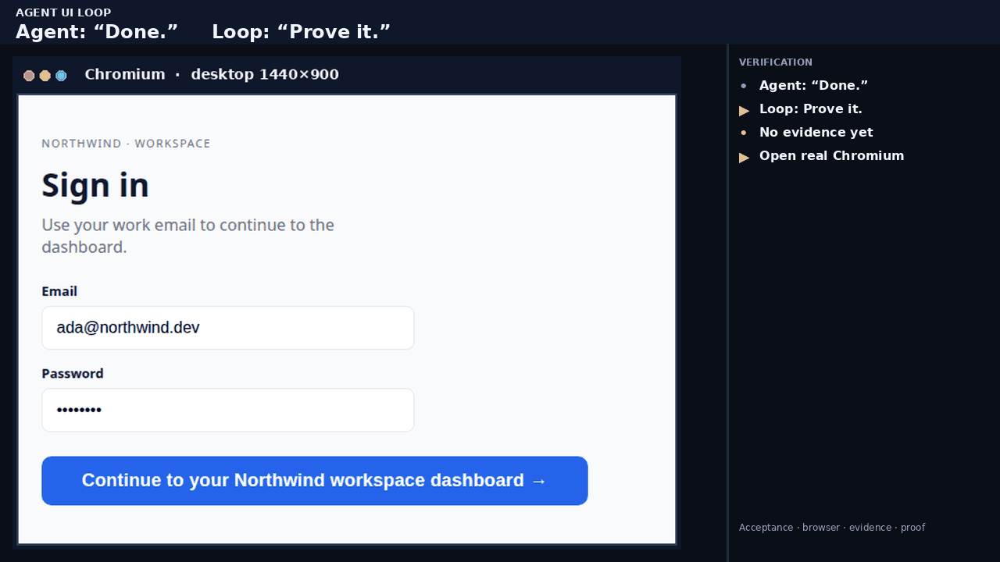
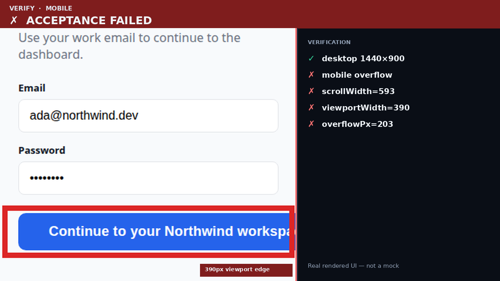
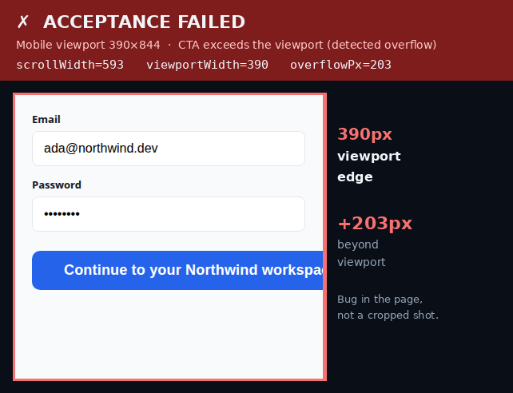
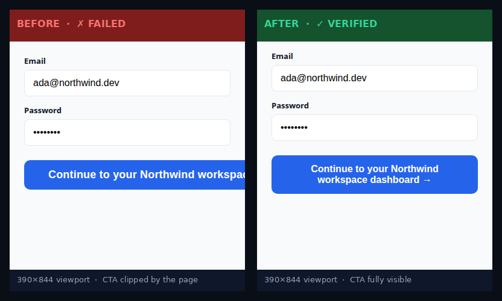
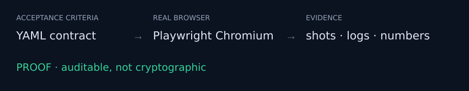
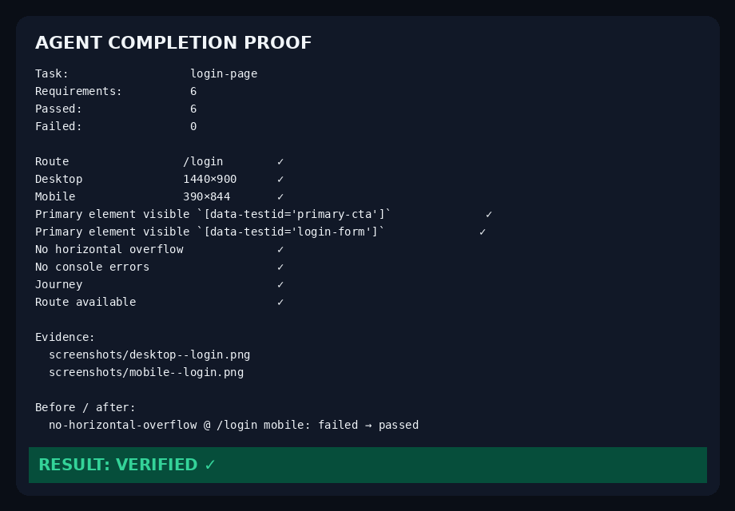

# Agent UI Loop

**Your agent can code. Now make it prove the UI.**



AI coding agents are very good at saying “done.”
Agent UI Loop makes that claim testable.

It runs your real app in a browser, checks explicit acceptance criteria,
captures evidence, and produces proof of completion.

[](pyproject.toml)
[](LICENSE)

## Quickstart

Not on PyPI yet. Install from this repository:

```bash
pip install .
python -m playwright install chromium
agent-ui-loop demo
```

That is the whole first run. The demo ships a login page, **fails a real mobile overflow**, writes evidence, applies a CSS fix **to the sample app only**, reverifies, and prints **VERIFIED**.

```
Agent:  "Done."
Loop:   Prove it.
```

```
/login  mobile 390×844
  ✗  no-horizontal-overflow
      horizontal overflow: scrollWidth=593 viewportWidth=390
RESULT: FAILED  (1 check)
```

```
RESULT: VERIFIED ✓
```


<p align="center"><sub>Command + result from a real demo run. Full transcript: <a href="assets/screenshots/demo-run.txt">assets/screenshots/demo-run.txt</a></sub></p>

Then, on your app:

```bash
agent-ui-loop --help
agent-ui-loop init --url http://localhost:3000
agent-ui-loop run --url http://localhost:3000
agent-ui-loop prove
```

Chromium is required. The first browser launch installs it if missing; CI should still run `python -m playwright install chromium --with-deps`.

## Works with

| Agent | How |
| --- | --- |
| **Claude Code** | Native skill: [`.claude/skills/agent-ui-loop/SKILL.md`](.claude/skills/agent-ui-loop/SKILL.md) (`init` copies it into the project) |
| **Cursor** | Adapter — CLI workflow in [`adapters/cursor`](adapters/cursor) |
| **Codex** | CLI-compatible — [`adapters/codex`](adapters/codex) |
| **OpenCode** | CLI-compatible — [`adapters/opencode`](adapters/opencode) |

The product is the CLI protocol (`run` → evidence → `prove`). Adapters do not fork the runner.

---

## From “Done” to “Proved”



<p align="center"><sub>Same 16:9 composition as the GIF (FAIL beat). Real screenshot + real measurements.</sub></p>

```
Agent
  →  DONE
Agent UI Loop
  →  ACCEPTANCE
  →  REAL BROWSER
  →  VERIFICATION
  →  EVIDENCE
  →  FIX
  →  REVERIFY
  →  PROOF
```

An agent can ship a login page that looks fine at 1440×900 and still overflow at 390×844. “Done” is a claim. Overflow `scrollWidth=593` vs `viewportWidth=390` is a measurement.



<p align="center"><sub>The blue CTA is cut off by the <strong>390px mobile viewport</strong> (the bug). The red banner is wide enough to show the full measurements: <code>scrollWidth=593</code>, <code>viewportWidth=390</code>, <code>overflowPx=203</code>.</sub></p>



<p align="center"><sub>Same 390×844 framing. Left: CTA clipped by the viewport. Right: after the sample-app CSS fix, the full CTA is visible and the run is VERIFIED.</sub></p>

The demo **does** edit the sample app’s CSS. It does **not** edit your repository.

---

## What it verifies

Checks are deterministic (DOM, geometry, console, network, files). Not an LLM.

**UI**

| Check | Measures |
| --- | --- |
| `element-exists` / `element-visible` | selector present / visible |
| `element-in-viewport` | bounding box vs viewport |
| `no-horizontal-overflow` | `scrollWidth` vs `innerWidth` |
| `no-clipping` | testids without intersection |
| `no-broken-images` | `img.naturalWidth === 0` |

**Runtime**

| Check | Measures |
| --- | --- |
| `no-console-errors` | `console.error` / page errors |
| `no-network-failures` | failed or 4xx/5xx requests |
| `route-available` | the route responds |

**HTTP / code / tests**

| Check | Measures |
| --- | --- |
| `http-status` | status code for a path |
| `file-exists` | path on disk |
| `command` | argv subprocess, allowlisted binaries, no shell |

**Journeys** (not an E2E framework): `fill`, `click`, `visible`, `wait`

**Optional:** `a11y-names`, `a11y-contrast`, `reference-compare`, `color_schemes`. Useful, not a visual-regression product.

Schema: [`docs/acceptance-contract.md`](docs/acceptance-contract.md).

---

## Acceptance contract

Copy, change `url` and selectors, run. This is the current schema:

```yaml
task:
  name: responsive-login

url: http://localhost:3000

routes:
  - /login

viewports:
  - name: desktop
    width: 1440
    height: 900
  - name: mobile
    width: 390
    height: 844

requirements:
  - type: element-visible
    selector: "[data-testid='primary-cta']"
  - type: element-visible
    selector: "[data-testid='login-form']"
  - type: no-horizontal-overflow
  - type: no-console-errors
  - type: no-network-failures
  - type: route-available
```

More: [`contracts/`](contracts/), [`examples/`](examples/).



---

## Proof

This is **auditable evidence, not cryptographic proof.**



<p align="center"><sub>Machine-readable proof from a verified run. Raw artifact: <a href="assets/examples/proof.json">assets/examples/proof.json</a> · text: <a href="docs/sample-proof.txt">docs/sample-proof.txt</a></sub></p>

Fields the implementation actually writes (`kind: agent-completion-proof`, `schemaVersion: 3`):

```
AGENT COMPLETION PROOF
Task:                  login-page
Requirements:          6
Passed:                6
Failed:                0
Route                 /login        ✓
Desktop               1440×900      ✓
Mobile                390×844       ✓
… visibility, overflow, console, journey, route …
RESULT: VERIFIED ✓
```

Each run directory:

```
.agent-ui-loop/runs/<id>/
  proof.json   proof.txt   proof.md   github.md
  report.json  graph.json  run-meta.json
  screenshots/ logs/
```

Format: [`docs/proof-format.md`](docs/proof-format.md).

---

## GitHub Action

This repository ships a **composite** Action ([`action.yml`](action.yml)). It is **not** a GitHub Marketplace listing. After checkout, reference this repo with `uses: ./`.

It will not start your app. Serve a URL, then verify. Chromium is installed with `--with-deps`. Artifacts (`proof`, screenshots, reports) upload as `agent-ui-proof`. `github.md` is appended to the job summary. Optional PR comment needs `comment: true` and a token.

```yaml
- uses: actions/checkout@v4

# start your UI so the URL responds

- uses: ./
  with:
    url: http://127.0.0.1:3000
    config: agent-ui-loop.yml
    comment: "false"
```

Full workflow sketch: [`examples/github-workflow.yml`](examples/github-workflow.yml).

No GitHub UI screenshot is included — this environment did not produce a live Actions run to photograph.

---

## Agent integrations

```
WRITE → RUN → VERIFY → EVIDENCE → FIX → REVERIFY → PROVE
```

1. Agent edits the UI.
2. `agent-ui-loop run` (or `--json`).
3. Agent reads failures + evidence (not vibes).
4. Agent fixes the UI.
5. Re-run until pass.
6. `agent-ui-loop prove` → **VERIFIED**.

Claude Code skill teaches that loop. Cursor / Codex / OpenCode use the same CLI.

---

## What this is not

Not another E2E framework, browser-automation library, visual-regression SaaS, screenshot utility, or AI UI generator.

**What it adds:** acceptance criteria + real-browser verification + evidence + proof + reverification.

Category: **Agent UI Verification** for AI coding agents.

---

## Examples

Runnable contracts against the bundled login fixture:

```bash
python examples/serve.py          # terminal 1
agent-ui-loop run --config examples/mobile-overflow/agent-ui-loop.yml --url http://127.0.0.1:48721
```

| Path | Story |
| --- | --- |
| [`examples/mobile-overflow`](examples/mobile-overflow/) | Mobile overflow fails on purpose |
| [`examples/responsive-ui`](examples/responsive-ui/) | Two viewports, layout + runtime |
| [`examples/login-flow`](examples/login-flow/) | Form + journey fill/click |
| [`examples/journey`](examples/journey/) | Continue → dashboard |

---

## Repository structure

```
src/agent_ui_loop/     CLI, runner, checks, demo, proof
contracts/             copyable YAML
examples/              runnable stories
adapters/              Cursor / Codex / OpenCode
checks/                how to add a check
.claude/skills/        native Claude Code skill
action.yml             composite GitHub Action
assets/                real demo visuals + brand diagrams
docs/                  contract, proof format, security
```

---

## Contributing

Checks, adapters, examples, contracts, and docs are the useful surface. See [`CONTRIBUTING.md`](CONTRIBUTING.md).

---

## Installation and CLI

```bash
pip install .
python -m playwright install chromium
agent-ui-loop init
agent-ui-loop run --url http://localhost:3000
agent-ui-loop prove
agent-ui-loop compare
agent-ui-loop demo
```

| Command | Purpose |
| --- | --- |
| `init` | Write `agent-ui-loop.yml` + Claude skill |
| `run` / `check` | Verify in Chromium |
| `prove` | Print proof for the latest run |
| `compare` | Before/after of the last two runs |
| `demo` | Fail → sample fix → VERIFIED |

`--json` for agents. Exit `0` pass / verified, `1` failed checks, `2` config, `3` runtime.

When PyPI publication happens, `pip install agent-ui-loop` will be the canonical line. Until then, use `pip install .` from source.

Upload [`assets/social/github-social-preview.png`](assets/social/github-social-preview.png) manually in the GitHub repo settings if you want it as the social preview. The file does not apply itself.

---

## Limitations

- Playwright Chromium must be installed.
- You must serve the app; the Action and CLI do not start it (except `demo`).
- Journeys are four actions, not a full E2E runner.
- Optional a11y / reference / color-scheme checks are not a visual QA suite.
- Layer-2 “vision” is not a working product in this release.
- Auth walls, captchas, and third-party widgets are outside the default contract.
- `command` checks are argv + allowlist only.
- Proof is auditable evidence, not cryptography.
- Package and Marketplace publication are **not** done.

---

## Development

```bash
pip install -e ".[dev]"
python -m playwright install chromium
pytest
agent-ui-loop demo
python scripts/build_release_assets.py   # regenerates assets/ from a live run
```

[`CHANGELOG.md`](CHANGELOG.md) · [`docs/SECURITY.md`](docs/SECURITY.md) · [`docs/evidence-graph.md`](docs/evidence-graph.md)

---

## License

MIT
